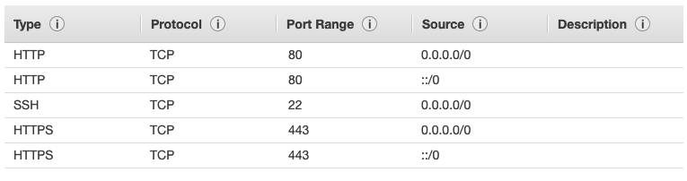
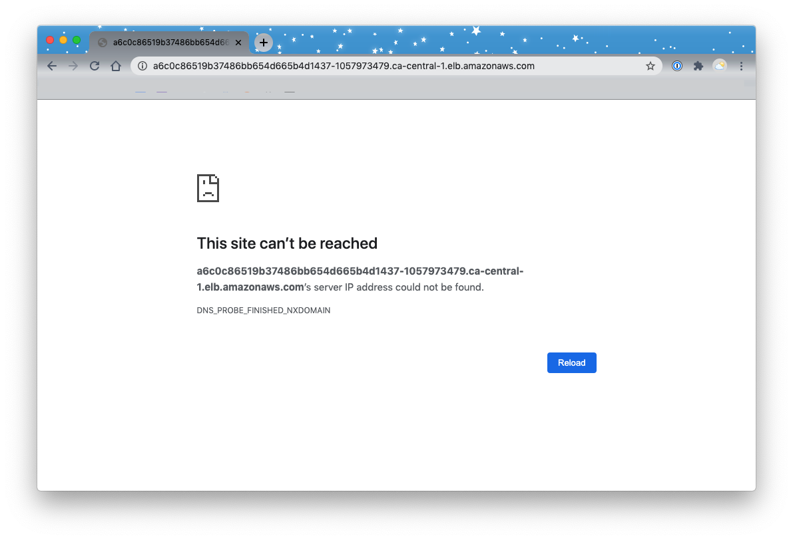
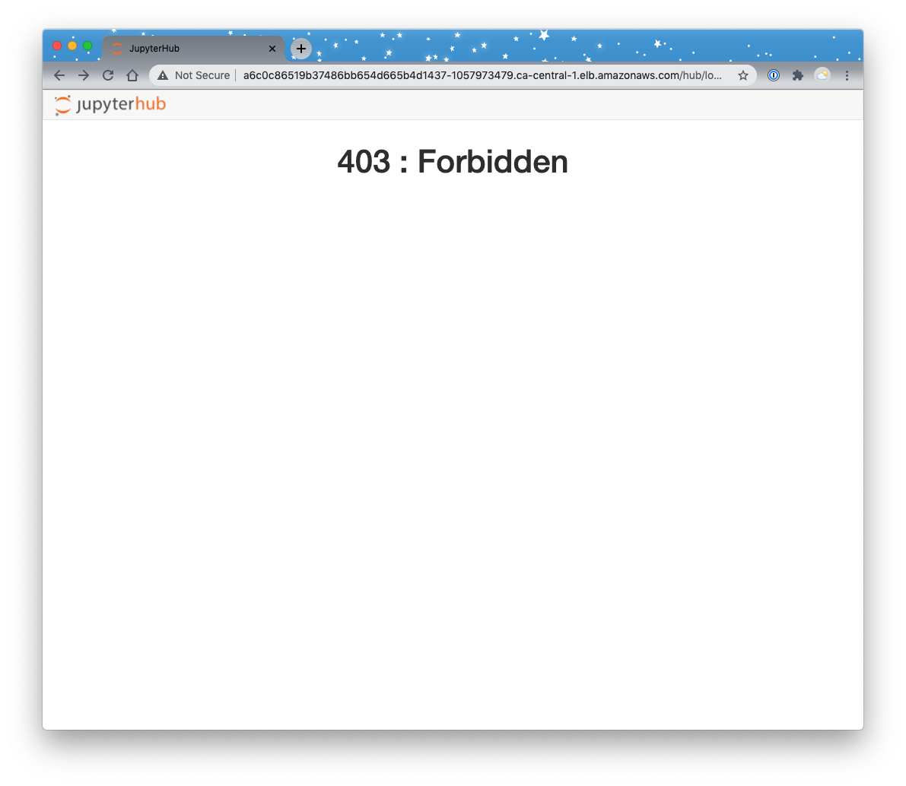
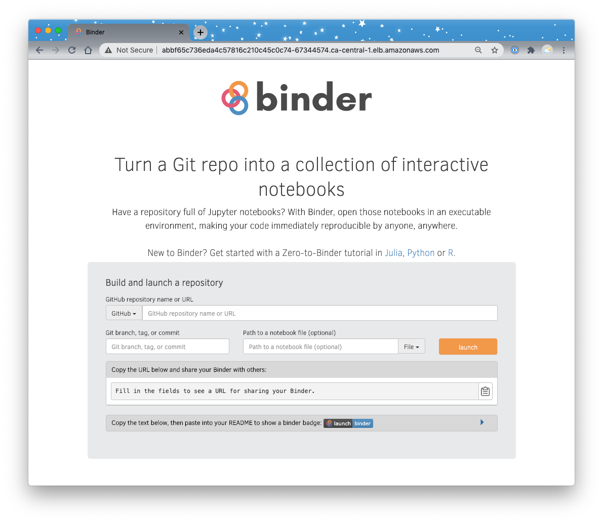
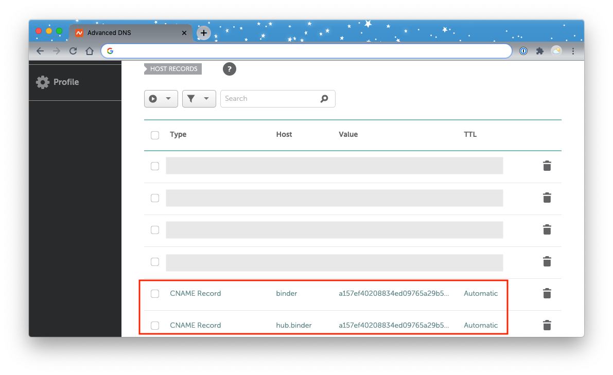
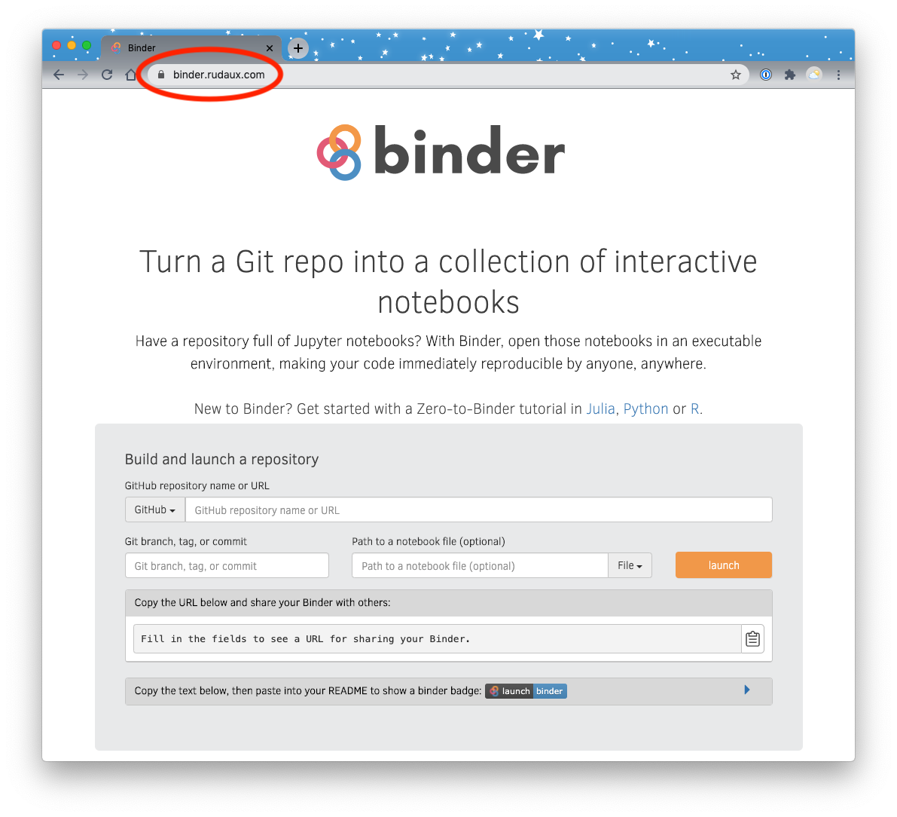

# Instructions for Setting up a BinderHub with AWS and DockerHub

This guide roughly follows the [Zero to BinderHub](https://binderhub.readthedocs.io/en/latest/zero-to-binderhub/) documentation. I found that guide vague in some places (for someone unfamiliar with BinderHub such as myself). Notably, the BinderHub team primarily use Google Cloud and there is less support/documentation for AWS (which is what I primarily use) so I decided to write down my workflow here for reproducibility and in case anybody stumbles across this repo looking for help.

Recall that [Binderhub](https://github.com/jupyterhub/binderhub) combines JupyterHub (spawning single user Jupyter Notebook servers) and Repo2Docker (for building Docker images from Git repositories) to provide on-demand Jupyter notebooks that do not require authentication.

This documentation focuses on using Amazon Elastic Kubernetes Service (EKS) to create and manage the cluster and DockerHub as the container registry.

Follow the steps below.

1. [Create an EC2 Instance](#2)
2. [Create a Cluster with EKS](#2)
3. [Set up BinderHub](#3)
4. [Customize and Secure BinderHub](#4)
5. [Tearing It All Down](#5)
6. [Cheat Sheet](#6)

## 1. Create an EC2 Instance <a name="1"></a>

>For those in the University of British Columbia Master of Data Science program, I've created an AMI called "binderhub" which you can create an instance from and jump to Step 2.

I used a t2.micro AWS EC2 instance to help set-up and manage my BinderHub but you could do this locally too. Follow the steps below to create an instace:

- Log in to the [AWS console](https://aws.amazon.com/) and go to the EC2 service.
- Make sure you're in your desired region (Canada: `ca-central-1` for me) and click "Instances" in the dashboard.
- Click "Launch Instance" and select the "Ubuntu Server 18.04 LTS (HVM), SSD Volume Type" AMI.
- In Step 2 (choose an instance type), Step 3 (configure instance) and Step 4 (add storage) leave the defaults.
- Add tags in Step 5 if you wish.
- In Step 6 choose "Create a new security group" and add the following rules:

- Click "Review and Launch", then click "Launch".
- Connect to the instance with SSH once it's ready.
- Once you're in it's a good idea to update ubuntu: `sudo apt-get update; sudo apt-get upgrade`.

## 2. Create a Cluster with EKS <a name="2"></a>

- From within your EC2 instance, you can now follow all the steps in the [AWS EKS docs](https://docs.aws.amazon.com/eks/latest/userguide/getting-started-eksctl.html)
- Complete the steps [Prerequisites](https://docs.aws.amazon.com/eks/latest/userguide/getting-started-eksctl.html#eksctl-prereqs) and [Install and configure kubectl](https://docs.aws.amazon.com/eks/latest/userguide/getting-started-eksctl.html#eksctl-kubectl) as outlined, choosing the `Linux` tab where necessary (for those in the University of British Columbia Master of Data Science program, I've created an AMI including all the steps up to and including this dot-point called "binderhub")
- When you get to the section [Create your Amazon EKS cluster and compute](https://docs.aws.amazon.com/eks/latest/userguide/getting-started-eksctl.html#eksctl-create-cluster), we need to do the following steps. These are required because EKS is no longer natively supporting docker, read more [here](https://github.com/weaveworks/eksctl/issues/942#issuecomment-515867547) and the solution comes from [here](https://gist.github.com/tobemedia/2144d74d232ccce8972613e8ae13b054).
  - run `ssh-keygen` and accept defaults to generate a key pair.
  - Create a file `nano aws_eks_config.yaml`
  - Fill it with the following (but feel free to modify things like the instanceType or Size if you want bigger/smaller capacity):

```yml
# file: aws_eks_config.yml
# AWS EKS ClusterConfig used to setup the BinderHub / JupyterNotebooks K8s cluster
# using a workaround from https://discourse.jupyter.org/t/binder-deployed-in-aws-eks-domain-name-resolution-errors/766/10
# to fix broken DNS resolution
--- 
apiVersion: eksctl.io/v1alpha5
kind: ClusterConfig

metadata:
  name: binderhub
  region: ca-central-1
  version: '1.17'

nodeGroups:
  - name: binderhub-nodes
    instanceType: t3.medium
    minSize: 1
    maxSize: 4
    desiredCapacity: 2
    preBootstrapCommands:
        # Replicate what --enable-docker-bridge does in /etc/eks/bootstrap.sh
        # Enabling the docker bridge network. We have to disable live-restore as it
        # prevents docker from recreating the default bridge network on restart
       - "cp /etc/docker/daemon.json /etc/docker/daemon_backup.json"
       - "echo -e '.bridge=\"docker0\" | .\"live-restore\"=false' >  /etc/docker/jq_script"
       - "jq -f /etc/docker/jq_script /etc/docker/daemon_backup.json | tee /etc/docker/daemon.json"
       - "systemctl restart docker"
```
  - Then run `eksctl create cluster --config-file aws_eks_config.yaml` to create the cluster
  - The cluster usually takes ~15 mins to build, check it has finished by running `kubectl get svc`

## 3. Set Up BinderHub <a name="3"></a>

- From here, just follow all the steps in the Zero-to-Binderhub guide starting from [1.2. Installing Helm](https://binderhub.readthedocs.io/en/latest/zero-to-binderhub/setup-prerequisites.html#installing-helm), and using DockerHub as the container registry.
- **WARNING**: when you get to [3.5. Connect BinderHub and JupyterHub](https://binderhub.readthedocs.io/en/latest/zero-to-binderhub/setup-binderhub.html#connect-binderhub-and-jupyterhub), you'll run the command `kubectl --namespace=<namespace-from-above> get svc proxy-public` to retrieve the JupyterHub "EXTERNAL-IP" address, but if you paste this url into a browser it won't work. It should display a simple JupyterHub "403 : Forbidden" page, but it doesn't, so we need to patch the LoadBalancer's port forwarding:

- Go to EC2 in the AWS web console -> Click Load Balancers in the side menu -> Find the load balancer, click on it and check the "Instances" tab -> you'll notice that the status of the Instance ID's is "OutOfService" -> now go to the "Description" tab -> Scroll down to the "Port Configuration" header and note that 80 TCP port, something like "*80 (TCP) forwarding to 32413 (TCP)*" -> Click “Health Check” tab -> Click "Edit Health Check" -> Change the "Ping Port" to the port that 80 (TCP) is being forwarded to, e.g., 32413.
- After you do this, refresh the JupyterHub url and you'll see this:

- Continue on with final steps in the Z2BH guide and you'll have you're own Binderhub:

- At the moment this binder is insecure, it works, but you may run into security issues down the line. In the next step we'll secure it for use with HTTPS traffic.

## 4. Customize and Secure BinderHub <a name="4"></a>

- We can secure our Binder by following steps at in [the BinderHub docs](https://binderhub.readthedocs.io/en/latest/https.html#secure-with-https). However, these are specific to Google Cloud and there are some tricks to get it to work on AWS. Read on.
- The first thing you need to do is buy a domain name to serve your binder from, e.g., you might buyt the domain `example.com`, and you can then serve your binder at `binder.example.com`. Buy the domain now and we'll use it a little later on. I've tried this with namecheap and Google Domains.
- Install cert-manager which will manage our TLS certificate `kubectl apply -f https://github.com/jetstack/cert-manager/releases/download/v0.11.0/cert-manager.yaml`
- Create `nano binderhub-issuer.yaml`:
```yml
apiVersion: cert-manager.io/v1alpha2
kind: Issuer
metadata:
  name: letsencrypt-production
  namespace: binderhub # you can view namespace with: kubectl get svc --all-namespaces
spec:
  acme:
    # You must replace this email address with your own.
    # Let's Encrypt will use this to contact you about expiring
    # certificates, and issues related to your account.
    email: <your-email-address>
    server: https://acme-v02.api.letsencrypt.org/directory
    privateKeySecretRef:
      # Secret resource used to store the account's private key.
      name: letsencrypt-production
    solvers:
    - http01:
        ingress:
          class: nginx
```
- `kubectl apply -f binderhub-issuer.yaml`
- Now we want to create an nginx-based LoadBalancer on AWS. I followed the [Kubernetes Ingress Nginx documentation](https://kubernetes.github.io/ingress-nginx/deploy/#aws) to do this which just required running: `kubectl apply -f https://raw.githubusercontent.com/kubernetes/ingress-nginx/controller-v0.35.0/deploy/static/provider/aws/deploy.yaml`
- Get the external IP of the newly created LoadBalancer: `kubectl -n ingress-nginx get svc ingress-nginx-controller`, think of this as the entry point to our cluster.
- Now we need to create CNAMES in our domain's DNS configuration for binder and jupyterhub that point to this LoadBalancer's IP. How this is done will depend on the provider but you just need to add a new CNAME record, give it a name (anyname you want but I recommend, `binder` for binder and `hub.binder` for jupyterhub). When we finish this section, your binder will be available at `binder.<your-domain-name>.com`. Here's an example:

 - Now we just need to adjust our existing `nano config.yaml` (in the `binderhub` directory) to account for our new domains and loadbalancer. Also note the inclusinog of the `cors` headers which helped by-pass security issues I was having (this took me forever to figure out and I eventually found a solution in the `mybinder.org` [deployment source files here](https://github.com/jupyterhub/binderhub/blob/089702b32dc0689ba432504724d82bb42ad2a94f/helm-chart/binderhub/values.yaml)):
```yaml
  config:
    BinderHub:
      hub_url: https://<jupyterhub-URL> # e.g. https://hub.binder.example.com
  
  cors: &cors
    allowOrigin: '*'

  jupyterhub:
    custom:
      cors: *cors
    ingress:
      enabled: true
      hosts:
        - <jupyterhub-URL> # e.g. hub.binder.example.com
      annotations:
        kubernetes.io/ingress.class: nginx
        kubernetes.io/tls-acme: "true"
        cert-manager.io/issuer: letsencrypt-production
        https:
          enabled: true
          type: nginx
      tls:
        - secretName: <jupyterhub-URL-with-dashes-instead-of-dots>-tls # e.g. hub-binder-example-com-tls
          hosts:
            - <jupyterhub-URL> # e.g. hub.binder.example.com

  ingress:
    enabled: true
    hosts:
      - <binderhub-URL> # e.g. binder.example.com
    annotations:
      kubernetes.io/ingress.class: nginx
      kubernetes.io/tls-acme: "true"
      cert-manager.io/issuer: letsencrypt-production
      https:
        enabled: true
        type: nginx
    tls:
      - secretName: <binderhub-URL-with-dashes-instead-of-dots>-tls  # e.g. binder-example-com-tls
        hosts:
          - <binderhub-URL> # e.g. binder.example.com
```
- Now just apply the new `config.yaml` and we are done! `helm upgrade binderhub jupyterhub/binderhub --version=0.2.0-n219.hbc17443 -f secret.yaml -f config.yaml`
- Secure!


## 5. Tearing It All Down <a name="5"></a>

- Follow the instructions in the [AWS docs](https://docs.aws.amazon.com/eks/latest/userguide/delete-cluster.html).

```bash
kubectl get svc --all-namespaces
kubectl delete svc --namespace <name> <service-name>
eksctl delete cluster --name <deployment_name>
```

## 6. Cheat Sheet <a name="6"></a>

For those that know what they're doing, here's a cheat sheet of all the install commands, starting from [Step 2](#2) above:

### Create Cluster

```sh
ssh-keygen
nano aws_eks_config.yaml
```

```yml
# file: aws_eks_config.yml
# AWS EKS ClusterConfig used to setup the BinderHub / JupyterNotebooks K8s cluster
# using a workaround from https://discourse.jupyter.org/t/binder-deployed-in-aws-eks-domain-name-resolution-errors/766/10
# to fix broken DNS resolution
--- 
apiVersion: eksctl.io/v1alpha5
kind: ClusterConfig

metadata:
  name: binderhub
  region: ca-central-1
  version: '1.17'

nodeGroups:
  - name: binderhub-nodes
    instanceType: t3.medium
    minSize: 1
    maxSize: 4
    desiredCapacity: 2
    preBootstrapCommands:
        # Replicate what --enable-docker-bridge does in /etc/eks/bootstrap.sh
        # Enabling the docker bridge network. We have to disable live-restore as it
        # prevents docker from recreating the default bridge network on restart
       - "cp /etc/docker/daemon.json /etc/docker/daemon_backup.json"
       - "echo -e '.bridge=\"docker0\" | .\"live-restore\"=false' >  /etc/docker/jq_script"
       - "jq -f /etc/docker/jq_script /etc/docker/daemon_backup.json | tee /etc/docker/daemon.json"
       - "systemctl restart docker"
```

```sh
eksctl create cluster --config-file aws_eks_config.yaml
kubectl get svc
```

### Install Helm

```sh
curl https://raw.githubusercontent.com/kubernetes/helm/master/scripts/get | bash
kubectl --namespace kube-system create serviceaccount tiller
kubectl create clusterrolebinding tiller --clusterrole cluster-admin --serviceaccount=kube-system:tiller
helm init --service-account tiller --history-max 100 --wait
kubectl patch deployment tiller-deploy --namespace=kube-system --type=json --patch='[{"op": "add", "path": "/spec/template/spec/containers/0/command", "value": ["/tiller", "--listen=localhost:44134"]}]'
helm version
```

### Install BinderHub

```sh
mkdir binderhub
cd binderhub
openssl rand -hex 32 # these will be entered into secret.yaml
openssl rand -hex 32
nano secret.yaml # enter the following
```

```yml
jupyterhub:
  hub:
    services:
      binder:
        apiToken: "<first hex>"
  proxy:
    secretToken: "<second hex>"
registry:
  username: <docker_username>
  password: <docker_password>
```

```sh
nano config.yaml # enter the following
```

```yml
config:
  BinderHub:
    use_registry: true
    image_prefix: tbeuzen/mds-binderhub-dev-
```

```sh
helm repo add jupyterhub https://jupyterhub.github.io/helm-chart
helm repo update
helm install jupyterhub/binderhub --version=0.2.0-n219.hbc17443  --name=binderhub --namespace=binderhub -f secret.yaml -f config.yaml
kubectl --namespace=binderhub get svc proxy-public
nano config.yaml # enter the following
```

```yml
config:
  BinderHub:
    use_registry: true
    image_prefix: tbeuzen/mds-binderhub-dev-
    hub_url: http://<enter EXTERNAL-IP output from the previous command>
```

```sh
helm upgrade binderhub jupyterhub/binderhub --version=0.2.0-n219.hbc17443 -f secret.yaml -f config.yaml
kubectl -n binderhub get svc binder
```

### Secure BinderHub

```sh
kubectl apply -f https://github.com/jetstack/cert-manager/releases/download/v0.11.0/cert-manager.yaml
nano binderhub-issuer.yaml
```

```yml
apiVersion: cert-manager.io/v1alpha2
kind: Issuer
metadata:
  name: letsencrypt-production
  namespace: binderhub # you can view namespace with: kubectl get svc --all-namespaces
spec:
  acme:
    # You must replace this email address with your own.
    # Let's Encrypt will use this to contact you about expiring
    # certificates, and issues related to your account.
    email: <your-email-address>
    server: https://acme-v02.api.letsencrypt.org/directory
    privateKeySecretRef:
      # Secret resource used to store the account's private key.
      name: letsencrypt-production
    solvers:
    - http01:
        ingress:
          class: nginx
```

```sh
kubectl apply -f binderhub-issuer.yaml
kubectl -n ingress-nginx get svc ingress-nginx-controller
# create cnames in the domain DNS configuration now
nano config.yaml
```

```yaml
config:
  BinderHub:
    use_registry: true
    image_prefix: tbeuzen/mds-binderhub-dev-
    hub_url: https://hub.binder.rudaux.com # e.g. https://hub.binder.example.com

cors: &cors
  allowOrigin: '*'

jupyterhub:
  custom:
    cors: *cors
  ingress:
    enabled: true
    hosts:
      - hub.binder.rudaux.com # e.g. hub.binder.example.com
    annotations:
      kubernetes.io/ingress.class: nginx
      kubernetes.io/tls-acme: "true"
      cert-manager.io/issuer: letsencrypt-production
      https:
        enabled: true
        type: nginx
    tls:
      - secretName: hub-binder-rudaux-com-tls # e.g. hub-binder-example-com-tls
        hosts:
          - hub.binder.rudaux.com # e.g. hub.binder.example.com

ingress:
  enabled: true
  hosts:
    - binder.rudaux.com # e.g. binder.example.com
  annotations:
    kubernetes.io/ingress.class: nginx
    kubernetes.io/tls-acme: "true"
    cert-manager.io/issuer: letsencrypt-production
    https:
      enabled: true
      type: nginx
  tls:
    - secretName: binder-rudaux-com-tls  # e.g. binder-example-com-tls
      hosts:
        - binder.rudaux.com # e.g. binder.example.com
```

```sh
helm upgrade binderhub jupyterhub/binderhub --version=0.2.0-n219.hbc17443 -f secret.yaml -f config.yaml
```

```yml
apiVersion: cert-manager.io/v1alpha2
kind: Issuer
metadata:
  name: letsencrypt-production
  namespace: binderhub # you can view namespace with: kubectl get svc --all-namespaces
spec:
  acme:
    # You must replace this email address with your own.
    # Let's Encrypt will use this to contact you about expiring
    # certificates, and issues related to your account.
    email: tomas.beuzen@gmail.com
    server: https://acme-v02.api.letsencrypt.org/directory
    privateKeySecretRef:
      # Secret resource used to store the account's private key.
      name: letsencrypt-production
    solvers:
    - http01:
        ingress:
          class: nginx
```